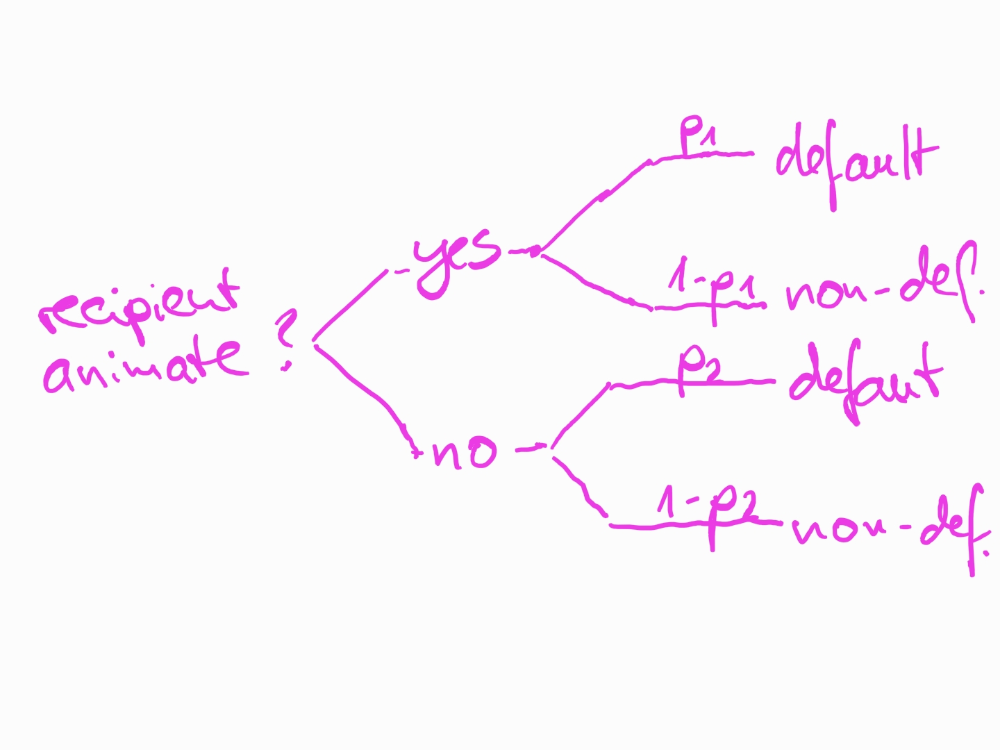

---
output:
  pdf_document: default
html_document: default
editor_options: 
  chunk_output_type: console
---
  
```{r include=FALSE}
knitr::opts_chunk$set(echo = T)
set.seed(123)

is_interactive <- FALSE
```

```{r echo=FALSE, results='hide', message=FALSE, echo = F}

library(dplyr)
library(magrittr)
library(tidyr)
library("scatterplot3d")
library(magrittr)
library(languageR)
library(ggplot2)
theme_set(theme_bw())
options(dplyr.summarise.inform = FALSE)
library(ggpubr)


library(rgl)
library(knitr)
knit_hooks$set(webgl = hook_webgl)

```

# Statistical Models

### A First Statistical Model

*(This will be a somewhat clumsy model, and we'll develop a better one later.)*

- The main aim of a generative model is to describe how the data we observed is generated.
- Let's create a simple model of observed word order, with the following assumptions

 
- It follows from this model that the following observations have the following probabilities:

| recipient  | observation \ *(default word order?)* | probability |
|:-----------|:--------------------|:------------|
| animate    | $1$                 | $p_1$|
| animate    | $0$                 | $1-p_1$|
| inanimate  | $1$                 | $p_2$|
| inanimate  | $0$                 | $1-p_2$|

- Doesn't this mean that we could even compute the is the probability of the data, if we only knew $p_1$, and $p_2$? Absolutely!
- Lets call our vector of observations $(y_1, y_2, y_3, \ldots, y_n)$. Given specific values for the parameters $p_1, p_2$, the probability of each individual observation of $P(y_n|p_1,p_2)$ can be read is given in the above table. 
- If we can compute the probability of one observation, we should be able to compute the probability of a whole data set.
- Remember the *joint probability* of two independent events $A$, $B$? It's $P(A) \cdot P(B)$.

- ... and because our generative process described by the graphic above **assumes independence** of observations (*i.e., it doesn't assume dependence*), we can compute the the probability of the data set as:
$$P(y_1,~y_2,~...,~y_n|p_1,~p_2) = P(y_1|p_1, p_2) \cdot P(y_2|p_1, p_2)\cdot ... \cdot P(y_n|p_1,p_2)$$
- Let's write an R function which will compute the probability of each data point, and one that will compute the probability of the data set.

```{r}
compute_prob_observation <- function(is_rec_animate, is_default_wo, p1, p2)
{
  # make sure we're dealing with a single observation, i.e., vector length == 1
  stopifnot(length(is_default_wo) == 1 && length(is_rec_animate) == 1)
  
  # different courses of action for animate and inanimate recipients
  if (is_rec_animate) { # I'll use if/else, but nested ifelse() calls will work just as well
    prob_of_observation <- ifelse(is_default_wo, p1, 1-p1)

  } else { # i.e., if is_rec_animate is FALSE (i.e., !is_rec_animate is TRUE)
    prob_of_observation <- ifelse(is_default_wo, p2, 1-p2)
  }
  
  prob_of_observation # this what the function returns
}
```

- Let's test it:
```{r}
compute_prob_observation(is_rec_animate = 1, is_default_wo = 1, p1 = .1, p2 = .7)
```
- OK.

```{r}
compute_prob_observation(is_rec_animate = 1, is_default_wo = 0, p1 = .1, p2 = .7)
```
- OK.
```{r}
compute_prob_observation(is_rec_animate = 0, is_default_wo = 1, p1 = .1, p2 = .7)
```
- OK.
```{r}
compute_prob_observation(is_rec_animate = 0, is_default_wo = 0, p1 = .1, p2 = .7)
```
- OK. It seems to do what it's supposed to.


- Now let's write a function that does it for two vectors, one vector of observations and one of animacy values: 
```{r}
# We'll need to use sapply, which runs through a vector of elements and calls a function for each element
# For example:
sapply(1:10, print)
```

```{r}
compute_probs_all_observations <- function(is_rec_animate, is_default_wo, p1, p2)
{
  # make sure the input vectors are of equal length
  stopifnot(length(is_default_wo) == length(is_rec_animate) )

  # create a function which computes the probability of the i-th observation
  compute_prob_ith_observations <- function(i) {
      compute_prob_observation(is_rec_animate = is_rec_animate[i], is_default_wo = is_default_wo[i], p1 = p1, p2 = p2)
  }
    
  # iterate over all positions in the vectors and compute the probability of 
  # the i-th observation on each iteration
  # (sapply iterates over a vector)
  sapply(1:length(is_default_wo), compute_prob_ith_observations)
}
```

- Let's try it out on some artificial data:
```{r}

# Let's take a look at the output of the function, with (rather extreme) made-up data, ...
# ... sample size 10 per group
n <- 5

# 10 1-s, and 10 0-s
is_rec_animate <- c(rep(1,n), rep(0,n))
# only default word orders for animate recipients, only non-default for the others
is_default_wo <- c(rep(1,n), rep(0,n))

synth_df <- data.frame(is_rec_animate, is_default_wo) 
View(synth_df)

# compute the probability for the first 
probs <- compute_probs_all_observations(is_rec_animate, is_default_wo, p1 = .5, p2 = .5)
```

- How likely are such extreme data under $p_1=0.5$ and $p_2=0.5$?
```{r}
# are data like this unlikely under p1=0.5 and p2=0.5?
probs
```

- Not very unlikely. What about the entire dataset?

```{r}
prod(probs)
```

- Quite *"unlikely"*, but that's because many numbers $<1$ were multiplied. Would other parameters do any better? 


```{r, eval=F, echo=FALSE}

probs_dataset <-
plyr::ldply(seq(0, 1, .01), function(p1) {
    plyr::ldply(seq(0, 1, .01), function(p2) {
        probs <- compute_probs_all_observations(is_rec_animate, is_default_wo, p1 = p1, p2 = p2)
        prob_dataset <- prod(probs)
        data.frame(p1=p1, p2=p2, prob=prob_dataset)
    })
})

head(probs_dataset)
```

```{r, fig.height=10, fig.width=10, echo=FALSE, webgl=TRUE, results='hide'}
library(rgl)

f_compute_probs_all_observations <- function(p1, p2)
{
  stopifnot(length(p1) == length(p2))
  sapply(1:length(p1), function(i) {
    compute_probs_all_observations(is_rec_animate, is_default_wo, p1 = p1[i], p2 = p2[i]) %>%
      prod()
  })
}

plot3d(f_compute_probs_all_observations,
       col = colorRampPalette(c("blue", "white")), 
       xlab = "p1", ylab = "p2", zlab = "Dataset likelihood",
       #, 
       #xlim = 6.5+c(-1, 1), ylim = 2.5+c(-1, 1),
       aspect = c(1, 1, 0.5))

```

- Apparently some values for $p_1$ and $p_2$ are better than others. Can you tell from the plot what they are?
 
## Log-likelihood and numerical underflow
- Now, let's apply this logic to the entire dataset. First, let's check for $p_1=0.5$ and $p_2=0.5$. 
```{r}

library(languageR)

# bring the observations into a usable format
dative %<>% mutate(is_default_wo = (RealizationOfRecipient == "NP") )
dative %<>% mutate(is_rec_animate = (AnimacyOfRec == "animate") )

# compute the probability for the first 
probs <- compute_probs_all_observations(dative$is_rec_animate, dative$is_default_wo, p1 = .5, p2 = .5)
```

```{r}
prod(probs)
```

- Zero? Whaaaaaaaat is going on?
- Might the fact below be relevant? 

```{r}
nrow(dative)
```
- The product of many numbers between $0$ and $1$ is going to be practically $0$: $0.1\cdot0.1=0.01$, $0.1\cdot0.1\cdot0.1=0.001$, $0.1\cdot0.1\cdot0.1\cdot0.1=0.0001$.
- This results in *numerical underflows*. (Computers only have a limited precision.)

### Logarithm
- Only logarithms can help us now: $log_b(x) = y$, when $b^y = x$ *(with some details omitted)*
- In other words, the *logarithm of $x$ to base $b$ is $y$, which is the number by which you need to exponentiate $b$ to get $x$*
- For example, $log_{10}(100) = 2$, and $10^2 = 100$. Makes sense?

- So how will this help us?
  1. The logarithm maps numbers between $0$ and $1$ onto the range $-\infty$ and $0$, i.e. from $(0;1]$ to $(-\infty; 0]$. Thus, we can use half the number line just to express numbers between $0$ and $1$ (i.e., probabilities).
  2. Multiplication of regular probabilities corresponds to addition of log-probabilities:  
  $$log_b(x \cdot y) = log_b(x) + log_b(y)$$ 

- Let's take a look at this function ($log_{e}$):
```{r, fig.height=5, fig.width=10, echo=FALSE, results='hide'}
y <- c(0,-1,-2,-3,-4,-5)
df <- data.frame(x = exp(y), y = y, labels = as.factor(letters[1:6]) )
ggplot(data = df, aes(x, y)) + 
  stat_function(fun=log, xlim = c(.005,1), n=500) +
  geom_point(aes(color = labels, group = labels)) + 
  geom_segment(aes(x=0, y=y, xend=x, yend=y, color = labels, group = labels), linetype="dashed") + 
  geom_segment(aes(x=x, y=-Inf, xend=x, yend=y, color = labels, group = labels), linetype="dashed") +
  theme_bw() +
  #scale_x_continuous(breaks=df$x) +
  scale_y_continuous(breaks=df$y) +
  #scale_color_discrete(position = "none")+
  theme(legend.position = "none")
```

### Log-likelihood
  
- All this means that we can get the log-probability of the entire dataset by summing all individual log-probabilities
  $$log_b(p_1 \cdot p_2 \cdot \ldots \cdot p_n ) = log_b(p_1) + log_b(p_2) + \ldots log_b(p_n)$$

- Let's use this to compute a log-likelihood surface for $p_1$ and $p_2$ for the dative data set. The red point marks the *maximum likelihood* (i.e., the *'peak' likelihood*).
- Note that the likelihood profile is much more flat along the $p_2$ axis.

```{r, fig.height=5, fig.width=10, echo=FALSE, webgl=TRUE, results='hide'}
library(rgl)

f_compute_logprobs_all_observations <- function(p1, p2)
{
  stopifnot(length(p1) == length(p2))
  ret <- 
  sapply(1:length(p1), function(i) {
    ifelse(dative$is_rec_animate, ifelse(dative$is_default_wo, log(p1[i]), log(1-p1[i]) ), ifelse(dative$is_default_wo, log(p2[i]), log(1-p2[i]) ) ) %>% sum()
  })
  ifelse(is.infinite(ret), NA, ret)
}

plot3d(f_compute_logprobs_all_observations,
       col = colorRampPalette(c("blue", "white")), 
       xlab = "p1", ylab = "p2", zlab = "Dataset likelihood",
       xlim = c(0, 1), ylim = c(0, 1), zlim = c(-3000, -1800),
       aspect = c(1, 1, 0.5))
points3d(x=.76, y=.48, z = -1810, color = "red", size = 10)

```

- Below is are cross-sections of the above plot, with the red point marking the *maximum likelihood estimates* for $p_1$ and $p_2$. 

```{r, fig.height=5, fig.width=10, echo=FALSE, results='hide'}
dative %>% group_by(is_rec_animate) %>% summarize( mean(is_default_wo) )
#   is_rec_animate `mean(is_default_wo)`
#   <lgl>                          <dbl>
# 1 FALSE                          0.481
# 2 TRUE                           0.760

#f_compute_logprobs_all_observations(p1 = .76, p2 = .48)

max_log_lik <- f_compute_logprobs_all_observations(p1 = .76, p2 = .48)

df <- data.frame(x = .76, y = max_log_lik)
p1 <- ggplot(data=df) + stat_function(fun = function(x) f_compute_logprobs_all_observations(p1 = x, p2 = rep(.48, length(x)) ) ) + xlab("p1") + ylab("Log-likelihood") + facet_wrap(~"Log-likelihood by p1, for best p2 (=0.48)") + 
  geom_point(aes(x,y), size = 2, color = "red" ) + scale_y_continuous(limits = c(-3000,-1800))+ scale_x_continuous(limits = c(0,1))

df <- data.frame(x = .48, y = max_log_lik)
p2 <- ggplot(data=df) + stat_function(fun = function(x) f_compute_logprobs_all_observations(p1 = rep(.76, length(x)), p2 = x ) ) + xlab("p2") + ylab("Log-likelihood") + facet_wrap(~"Log-likelihood by p2, for best p1 (=0.76)") + 
  geom_point(aes(x,y), size = 2, color = "red" ) + scale_y_continuous(limits = c(-3000,-1800))+ scale_x_continuous(limits = c(0,1))


library(ggpubr)

suppressWarnings({
ggarrange(p1, p2)
})

```

- Let's take a look at why the likelihood profile for $p_2$ is more flat than for $p_1$: It's an issue of sample size. There are many fewer instances of inanimate recipients (first row) than animate recipients (second row).
- The flat likelihood profile for $p_2$ tells us that while the parameter which is the most likely to produce the observed data is $0.48$ (which is also the observed proportion $\hat{p_2}$), the data isn't all that much less likely under other values for $p_2$ (for example, $0.45$, $.5$, $.52$).

```{r, echo=FALSE, results='markup'}
dative %>% group_by(is_rec_animate) %>% summarize( perc_default_wo = mean(is_default_wo), N = n() ) %>% knitr::kable()
```

- Cool. So what can we do with this?

- Well, for one, we can compute the *relative likelihood* of the data for two sets of parameters.
- Remember that what we have plotted above is the log-likelihood of the data given the parameters, i.e. $log~P(D|p_1, p_2)$
- This means that: 

$$P(D|p_1=\theta_1, p_2=\theta_1)/P(D|p_1=\theta'_1, p_2=\theta'_1),$$ 

- because $e^{log(a)} = a$, since $log(x)$ and $e^x$ are inverses of each other:
$$e^{log( P(D|p_1=\theta_1, p_2=\theta_1)/P(D|p_1=\theta'_1, p_2=\theta'_1) )},$$

- and because $log(a/b) = log(a) - log(b)$:
$$e^{log( P(D|p_1=\theta_1, p_2=\theta_1)) - log(P(D|p_1=\theta'_1, p_2=\theta'_1) )}$$

- Great, now we can quantify for any parameter value $\theta'$, how much less likely the data are for that parameter value, than for the *maximum likelihood estimate* $\hat{\theta}$.
- We can even calculate an interval around $\hat{\theta}$, such that all $\theta'$s for which the data is considered too unlikely, falls outside of it.
- For a ratio of $0.5$, that interval is roughly $[.75;.77]$ for $p_1$, and $[.44;.52]$ for $p_2$.

```{r, fig.height=5, fig.width=10, echo=FALSE, results='hide'}

p1 <- ggplot(data=df) + stat_function(fun = function(x) exp( f_compute_logprobs_all_observations(p1 = x, p2 = rep(.48, length(x)) ) - max_log_lik) ) + xlab("p1") + ylab("Likelihood ratio (theta'/theta)") + facet_wrap(~"Likelihood ratio by p1, for best p2 (=0.48)") + scale_x_continuous(limits = c(.7,.8))

p2 <- ggplot(data=df) + stat_function(fun = function(x) exp( f_compute_logprobs_all_observations(p1 = rep(.76, length(x)), p2 = x ) - max_log_lik ) ) + scale_x_continuous(limits = c(.25,.75)) + xlab("p2") + ylab("Likelihood ratio (theta'/theta)") + facet_wrap(~"Likelihood ratio by p2, for best p1 (=0.76)")

library(ggpubr)

suppressWarnings({
ggarrange(p1, p2)
})

```

- But instead, we could ask ourselves, is $P(D|p_1,p_2)$ really what we want? Do we really want *the probability of the data given certain parameters*?
- In my opinion, it's not. We are actually interested in $P(p_1, p_2|D)$. And $P(D|p_1,p_2)$ is just a crude proxy for it.
- The problem is that one cannot maintain a frequentist view of probability *and* use the expression $P(p_1, p_2|D)$ ...
