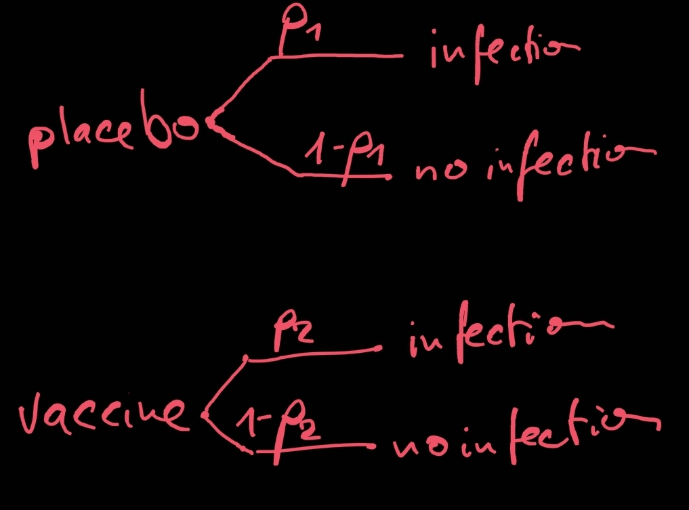
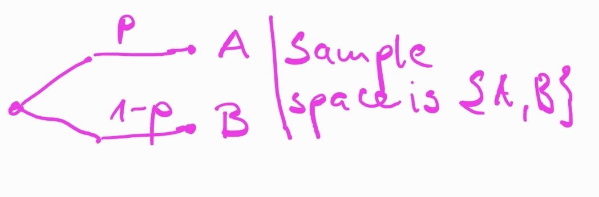

---
output:
  pdf_document: default
html_document: default
editor_options: 
  chunk_output_type: console
---
  
```{r include=FALSE}
knitr::opts_chunk$set(echo = T)
set.seed(123)

is_interactive <- FALSE
```

```{r echo=FALSE, results='hide', message=FALSE, echo = F}

library(dplyr)
library(magrittr)
library(tidyr)
library("scatterplot3d")
library(magrittr)
library(languageR)
library(ggplot2)
theme_set(theme_bw())
options(dplyr.summarise.inform = FALSE)
library(ggpubr)


library(rgl)
library(knitr)
knit_hooks$set(webgl = hook_webgl)

```

# Statistical Models II


- Sometimes we have data in a format that doesn't allow us a to formulate a generative model that goes *all the way*.

### Example 1
- For example here is data from two SinoVac phase-III trials (for the 'CoronaVac' vaccine). [Data: Jan 15, 2021]

| country    | group   | total participants | COVID-19 cases | incidence (**estimated** rate) | **estimated** vaccine efficacy |
|:-----------|:--------|:-------------------|:---------------|:---------------|:---------------|
| Brazil     | placebo | ~6500              | 167            | ~0.026         | ~0.5 $(1-0.013/0.026)$ |
|            | vaccine | ~6500              | 85             | ~0.013         | |
| Turkey     | placebo | 570                | 26             | ~0.046         | ~0.913 $(1-0.004/0.046)$ |
|            | vaccine | 752                | 3              | ~0.004         | |

- FYI: The vaccine efficacy is *'is the percentage reduction of disease in a vaccinated group of people compared to an unvaccinated group'*, we will calculate it as $1-incidence_{vaccine}/incidence_{placebo}$ for the present purposes.

- I'd like to model it similarly to our dative model, as below. (Keep in mind, this is not a mechanistic model of infection, but a statistical model. A lens through which we choose to look at the data.)

{height=300px}


- Our estimate of the vaccine efficacy would be $eff = 1-p_2/p_1$.

- So how do we compute the likelihood of each data point given the parameters?
- In the dative data set, our data points were 0s and 1s. Each corresponded to a single observation.
- Here, our observations are *aggregates* (i.e., 26 out of 570). That's a bit different.
- We could make up a data set with *'single observations'* that matches this statistic, and it will work in many cases, but not always.
- There is a better solution, though.

### Example 2
- The mammalian sleep data set. How do we model the number of hours animals sleep?  

```{r echo=FALSE}

mammalian_sleep <- 
  read.csv("./data/msleep_ggplot2.csv") %>% 
  dplyr::select(name, sleep_total, bodywt) %>%
  dplyr::rename(sleep_total_h = sleep_total, bodywt_kg = bodywt) %>%
  dplyr::mutate(sleep_total_h = round(sleep_total_h) )

mammalian_sleep$sleep_total_h
```

- No idea. But we have to do it somehow, right?


## Probability Distributions

- Luckily, our problems are not unique, and very cool solutions have been developed. 
- For many problems, it has been worked out what the probability distributions of some common generative processes are. 

- A **probability distribution** is an assignment of probabilites to events (i.e., an assignment of numbers such that it follows the laws of probability).
- A probability distribution with discrete outcomes can be characterized by its **probability mass function (PMF)**.

- Example: I could describe the outcomes of an experiment where I take one marble from a bag with one blue and three marbles with either of the following ditributions, depending on whether I'm interested in the particular marbles identity, or just their color:
  - Distribution 1: \
    $P(marble~1~[blue] ) = 0.25$ \
    $P(marble~2~[white]) = 0.25$ \
    $P(marble~3~[white]) = 0.25$ \
    $P(marble~4~[white]) = 0.25$
  - Distribution 2:           \
    $P(blue~marble~[1]) = 0.25~~~~~~~~~~~$ \
    $P(white~marble~[2,3,~or~4]) = 0.75$


### Bernoulli Distribution

- Below is the probability mass function for a **Bernoulli distribution** with the parameter $p=.6$.

- Generative process assumed by the **Bernoulli distribution**: a single *"trial"* which can result in either*"success"* or *"failure"*.

{height=100px}

- Examples: coin flip (H/T), drawing *one* marble (W/B), shooting (H/M) 

```{r, fig.height=2.5}
library(ggplot2)
df <- data.frame(successes = 0:1, prob = dbinom(0:1, size = 1, prob = .6) )
ggplot(df, aes(successes, prob)) + geom_bar(stat = "identity", width = 0.1)+scale_x_continuous(breaks=0:1) + facet_wrap(~"Bernoulli Distribution (p=.6)") + theme_bw()
```


## Binomial Distribution

- Generative process assumed by the **binomial distribution**: $n$ trials with a fixed probability $p$ of success. We count the number of successes.

{height=400px}

- Below are the PMFs for a **binomial distribution** with the parameters $n={2,10}$ and $p={0.3, 0.7}$.
- The value at every point $k$ represents the probability of $k$ successes out of $n$ attempts if the probability of a success on each trial is $p$.

```{r, fig.height=2.5, echo=FALSE}
df1 <- data.frame(successes = 0:2, prob = dbinom(0:2, size = 2, prob = .3) ) %T>% {.$label <- "Binomial Distribution (n=2, p=.3)"}
df2 <- data.frame(successes = 0:10, prob = dbinom(0:10, size = 10, prob = .3) ) %T>% {.$label <- "Binomial Distribution (n=10, p=.3)"}
df3 <- data.frame(successes = 0:2, prob = dbinom(0:2, size = 2, prob = .7) ) %T>% {.$label <- "Binomial Distribution (n=2, p=.7)"}
df4 <- data.frame(successes = 0:10, prob = dbinom(0:10, size = 10, prob = .7) ) %T>% {.$label <- "Binomial Distribution (n=10, p=.7)"}
df <- dplyr::bind_rows(df1, df3,df2,  df4)
ggplot(df, aes(successes, prob)) + geom_bar(stat = "identity", width = 0.1)+theme_bw()+scale_x_continuous(breaks=0:10) + facet_wrap(~label) + theme_bw()
```

- Examples of such processes are: flipping coins, looking at shirts in a store, yes/no acceptability judgements, searching a corpus, lending money, ...
- Numbers generated by a mechanism that fits this description will will be distributed binomially ($X \sim B(n, k)$). 
- There is an equation for the PMF, but to us it's simply `dbinom(..., n, p)`, `pbinom()` and `rbinom(...)`.


### Gaussian Distribution ('Normal Distribution')

- Generative process assumed by the **gassian distribution**: it is limiting case of a *'substantial'* number of factors contributing to an outcome positively or negatively.
- Think about the generative process roughly as below:

{height=600px}

```{r, fig.height=2.5, echo=FALSE}

x_limits = c(-10,10)
y_limits = c(0,.5)
df <- data.frame(x=x_limits, y=y_limits)

p1 <- ggplot(data=df,aes(x=x, y=y)) + stat_function(fun = function(x) dnorm(x, mean=0, sd=1)) + scale_x_continuous(limits=x_limits)+scale_y_continuous(limits=y_limits)
p2 <- ggplot(data=df,aes(x=x, y=y)) + stat_function(fun = function(x) dnorm(x, mean=5, sd=1)) + scale_x_continuous(limits=x_limits)+scale_y_continuous(limits=y_limits)
p3 <- ggplot(data=df,aes(x=x, y=y)) + stat_function(fun = function(x) dnorm(x, mean=0, sd=2)) + scale_x_continuous(limits=x_limits)+scale_y_continuous(limits=y_limits)
p4 <- ggplot(data=df,aes(x=x, y=y)) + stat_function(fun = function(x) dnorm(x, mean=5, sd=2)) + scale_x_continuous(limits=x_limits)+scale_y_continuous(limits=y_limits)

library(ggpubr)

p <- ggarrange(p1+facet_wrap(~"mean=0, sd=1"), p2+facet_wrap(~"mean=5, sd=1"), p3+facet_wrap(~"mean=0, sd=2"), p4+facet_wrap(~"mean=5, sd=2"))
print(p)
```

- There is an equation for the PDF, but to us it's simply `dnorm(..., n, p)`, `pnorm()` and `rnorm(...)`.

## A likelihood function for the vaccine data

| country    | group   | total participants | COVID-19 cases | [log-]likelihood |
|:-----------|:--------|:-------------------|:---------------|:---------------|
| Brazil     | placebo | ~6500              | 167            | dbinom(167, 6500, $p_{1B}$[, log=T]) |
|            | vaccine | ~6500              | 85             | dbinom(85, 6500, $p_{2B}$[, log=T]) |
| Turkey     | placebo | 570                | 26             | dbinom(26, 570, $p_{1T}$[, log=T]) |
|            | vaccine | 752                | 3              | dbinom(3, 752, $p_{2T}$[, log=T]) |

- OK. So let's write one log-likelihood function for the Brazil trial, and one for the Turkey trial and plot the log-likelihood as a function of the parameters $p_{1B,T}$ and $p_{2B,T}$.  
```{r}
```

## Bayesian Inference I

- Now we know the relative likelihood of the data under different parameters $\theta$ (in our case: $p_1, p_2$), i.e., $P(D|\theta)$. [Think of $\theta$ as something of a *pronoun for parameters*.]
- But I want to know the relative likelihood of the parameters given the data $P(\theta|D)$.
- According to the definition of conditional probability, we know two things to be true:
  1. $P(H|D) = P(H, D) / P(D)$ \
  $\Longrightarrow$ $P(H|D) \cdot P(D) = P(H, D)$
  2. $P(D|H) = P(D, H) / P(H)$ \
  $\Longrightarrow$ $P(D|H) \cdot P(H) = P(D, H)$

- Because $P(H, D)$ and $P(H, D)$ are the same thing (the joint probability of $H$ and $D$), the left sides of the above equations in brackets are also equal:\
  * $P(H|D) \cdot P(D) = P(D|H) \cdot P(H)$ \
    $\Longrightarrow$ $P(H|D) =  \frac{ P(D|H) \cdot P(H) }{P(D)}$


- The result we just obtained is known as the **Bayes Theorem**:
  $$P(H|D) = \frac{ P(D|H) \cdot P(H) }{P(D)}$$
  - P(H|D): probability of a hypothesis after seeing the data, or the **posterior probability** of the hypothesis.
  - P(D|H): probability of seeing such data under that hypothesis, or the **likelihood** of the data under the hypothesis.
  - P(H): probability of the hypothesis being true, or the **prior probability** of the hypothesis.
  - P(D): probability of seeing such data under any hypothesis, or the **marginal probability of the data**.
 
- In other words:
  $$Posterior~prob. = \frac{ Likelihood \cdot Prior~prob. }{Marginal~prob.~of~the~data}$$

## Returning to Example 1

- Let's use only the placebo arm of the Brazil trial, i.e., *'167 events on ~6500 trials'* to estimate a *plausible range for the incidence* in similar groups, under similar conditions.   
- We know that the parameter $p_{1B}$ is probably somewhere in the vicinity of the incidence rate (i.e., $0.026$). The question is, how close a vicinity?
- We'll use the Bayes Theorem:

### Likelihood
- Let's use only the placebo group of the Brazil data and assume that we have only five possibly hypotheses:
  - $H_1$:$~p_1=0.020$
  - $H_2$:$~p_1=0.025$
  - $H_3$:$~p_1=0.030$
  - $H_4$:$~p_1=0.035$
  - $H_5$:$~p_1=0.040$
```{r}
p1B <- c(.02, .025, .03, .035, .04)
```

- Let's compute $P(D|H)$, *the likelihood of the data under each hypothesis.* We know how to do it, just use `dbinom`.
```{r}
(likelihood <- dbinom(x=167, size=6500, prob=p1B))
```


```{r echo=FALSE, fig.height=2.5}
ggplot(data=NULL, aes(x=p1B, y=likelihood)) + geom_bar(stat="identity", width=.001) + theme_bw()
```

### Prior
- Now what do we do about the prior? I have no idea. So let's use what is called a **flat prior**: All hypotheses seem equally likely *a-priori*. Since there are 5 hypotheses, we therefore assign each hypothesis a probability of $1/5$.  
```{r}
(prior_p1B <- rep(1/5, 5))
```

```{r echo=FALSE, fig.height=2.5}
ggplot(data=NULL, aes(x=p1B, y=prior_p1B)) + geom_bar(stat="identity", width=.001) + theme_bw()
```


### Marginal probability of the data 

- So what is this *marginal probability of the data*? That is, the *average* probability of the data, i.e., under all possible hypotheses (weighted by their prior probability).

$$ P(D) = \sum_{i} P(D|H_i) \cdot P(H_i) $$
- *Please note that it's the sum of the expressions in the numerator*. 


- If the concept seems very alien to you, it may be based on the misconception that it's a *'real probability'*, i.e., something that exists in the real world.
- However, it is model-based construct. That is, under the kind of model we assume generated the data, what is the probability of such data?
- Another way to think about $P(D)$ is that it's simply a *'normalizing constant'*. Its purpose it to make sure that the probabilities add up to 1.

```{r}
(marginal_prob_data <- sum(likelihood * prior_p1B))
```

### Posterior probability

- Remember, $$Posterior~probability_{(H_i)} = \frac{ Likelihood_{(H_i)} \cdot Prior~probability_{(H_i)} }{Marginal~prob.~of~the~data}$$
- Let's use that to compute the posterior probability of our hypotheses.
```{r}
posterior_p1B <- (likelihood * prior_p1B) / marginal_prob_data
```

```{r echo=FALSE, fig.height=2.5}
ggplot(data=NULL, aes(x=p1B, y=posterior_p1B)) + geom_bar(stat="identity", width=.001) + theme_bw() + scale_y_continuous(breaks=seq(0,1,.1))
```

### And now again, for 

```{r}
p1B <- seq(0.015, 0.040, .001) # hypotheses
likelihood <- dbinom(x=167, size=6500, prob=p1B) # likelihood
prior_p1B <- rep(1/length(p1B), length(p1B)) # posterior
marginal_prob_data <- sum(likelihood * prior_p1B) # marginal prob of data
posterior_p1B <- (likelihood * prior_p1B) / marginal_prob_data # posterior for p1B 
```

```{r fig.height=2.5}
ggplot(data=NULL, aes(x=p1B, y=posterior_p1B)) + geom_point() + geom_line() + theme_bw() #+ scale_x_continuous(limits=c(0,.1))
```


## Bayesian Inference II

- Luckily, we don't have to do this every time. We can perform Bayesian with the R packages *brms*/*rstan*.
- In contrast to what we did above, though, we don't get back a plot, but a number of *samples from the posterior distribution*.
- Let's take a look at how it works:

```{r message=FALSE}
# load brms (you'll need to install 'brms', 'rstan', and possibly Rtools, depending on the system)
library(brms)
 
# define data frame
df <- data.frame(n_yes=167, n=6500)

# fit brms model
m1 <- brm(n_yes|trials(n) ~ 1, # model specification 
          data = df, # data
          family = binomial("identity"), # assume that the outcome is binomially distributed
          cores = 4, # use 4 cores
          file = "./models/model1" # save to file (WARNING: if file exists, model won't be fitted again even if it changed)
          ) 
summary(m1)
```

- As you see, the model ... 
  * ... provides coefficient *estimates* in the `Estimate` column under `Population-Level Effects` (estimate = $0.03$; rounded).
  * ... provides *credible intervals* (95\%) in the `l-95% CI`, and `u-95% CI` columns under `Population-Level Effects` ($CrI = [0.02; 0.03]$).
  * The most important result is the *95% credible interval* (usually *'CrI'*, sometimes *'CI'*). Our model tells us that with 95% probability, the parameter is in this range.

- 
```{r}
# extract samples from the model and take a look at them
samples1 <- posterior_samples(m1)
head(samples1, 5)

# compute exact credible interval
(cri95 <- HDInterval::hdi(samples1$b_Intercept))

# plot the samples histogram ...
p <- ggplot(samples1, aes(b_Intercept)) + geom_histogram(breaks=c(p1B-.001/2,0.040+.001) )
# ... anong with our old approximation ...
p <- p + geom_point(data=data.frame(p1B, posterior_p1B), aes(x=p1B, y=posterior_p1B*4000), color = "red") +
          geom_line(data=data.frame(p1B, posterior_p1B), aes(x=p1B, y=posterior_p1B*4000), color = "red")
# ... and the 95% CrI
p + geom_vline(xintercept = cri95['lower'], color = "blue") + geom_vline(xintercept = cri95['upper'], color = "blue")
```

## Back to our incidence rates

### Brazil

- Estimate a model under the assumption that $p = a + b \cdot c\_is\_vaccine$, where c_is_vaccine is a centered predictor.
  - *Intercept:* $a$ is the average incidence 
  - *Slope:* $b$ is the difference between $p_{1B}$ and  $p_{1T}$
  - Remember, the model will return samples that represent the posterior probability distribution over the *parameters* $a$ and $b$, not the *samples*! 


```{r message=FALSE}
# define data frame
df2 <- data.frame(n_yes = c(167, 85), 
                  n = c(6500, 6500),
                  c_is_vaccine = c(-0.5, 0.5)
                  )

# fit brms model
m2 <- brm(n_yes|trials(n) ~ 1 + c_is_vaccine, # model specification 
          data = df2, # data
          family = binomial("identity"), # assume that the outcome is binomially distributed
          cores = 4, # use 4 cores
          file = "./models/model2" # save to file (WARNING: if file exists, model won't be fitted again even if it changed)
          ) 
summary(m2)
```

```{r message=FALSE}
samples2 <- posterior_samples(m2)
head(samples2, 5)

# apply the reverse logic of the linear model to get posterior distributions for p1B and p2B from the infection model above
samples_p1B <-  samples2$b_Intercept - 0.5* samples2$b_c_is_vaccine
samples_p2B <-  samples2$b_Intercept + 0.5* samples2$b_c_is_vaccine

# use these samples to compute the posterior distribution of efficacy
samples_eff_Brazil <- 1 - samples_p2B/samples_p1B

# compute exact credible interval
(cri95_eff_Brazil <- HDInterval::hdi(samples_eff_Brazil))

# plot the samples histogram ...
p <- ggplot(data=NULL, aes(samples_eff_Brazil)) + geom_histogram(bins=50)
# ... and the 95% CrI
p + geom_vline(xintercept = cri95_eff_Brazil['lower'], color = "blue") + geom_vline(xintercept = cri95_eff_Brazil['upper'], color = "blue")

```

### Turkey

- Now let's do the same for the Turkey trial ...

<!--
- This means that: 
  $$P(H_{BS}|D) = \frac{ P(D|H_{BS}) \cdot P(H_{BS}) }{P(D)}$$, and $$P(H_{NBS}|D) = \frac{ P(D|H_{NBS}) \cdot P(H_{NBS}) }{P(D)}$$

- How do we compute the numbers in $P(H_{BS}|D) = \frac{ P(D|H_{BS}) \cdot P(H_{BS}) }{P(D)}$ and $P(H_{NBS}|D) = \frac{ P(D|H_{NBS}) \cdot P(H_{NBS}) }{P(D)}$
  
  
- **Likelihood:** Computing $P(D|H)$ is straightforward, given a reasonable statistical model of the data-generating process. In our case, it's `dbinom(8, 10, .75)` and `dbinom(8, 10, .5)`.
- **Prior:** The prior is supposed to encode the analyst's prior belief, based on previously seen data and domain knowledge. Let's use $0.5$ for both.
-->

